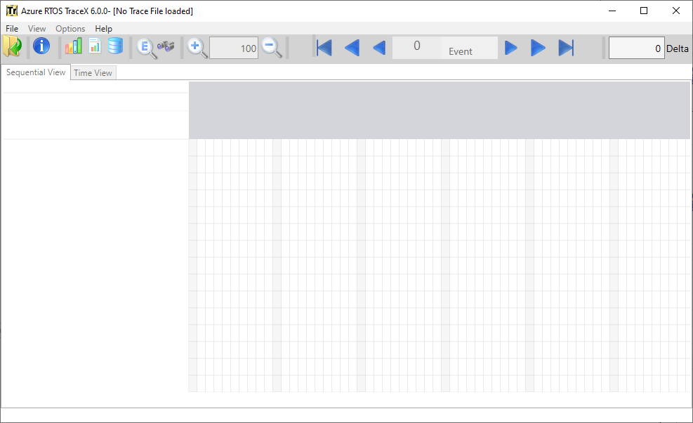

# Eclipse ThreadX TraceX

Eclipse ThreadX TraceX is a host-based analysis tool that provides developers with a graphical view of real-time system events and enables them to visualize and better understand the behavior of their real-time systems. With TraceX, developers can see clearly the occurrence of system events like interrupts and context switches that occur out of view of standard debugging tools. The ability to identify and study these events, and to pinpoint the timing of their occurrence in the context of the overall system’s operation enables developers to resolve programming problems by finding unexpected behavior and letting them investigate specific areas further Trace information is stored in a buffer on the target system, with the buffer location and size determined by the application at run-time. TraceX can process any buffer constructed in the proper manner, not only from Eclipse ThreadX RTOS, but from any application or RTOS. The trace information may be uploaded to the host for analysis at any time – either post mortem or upon a breakpoint. Eclipse ThreadX RTOS implements a circular buffer, which enables the most recent “N” events to be available for inspection in the event of system malfunction or other significant event.

The Eclipse ThreadX TraceX installer is available here: https://aka.ms/azrtos-tracex-installer.

## Getting Started

See [Overview of TraceX](https://github.com/eclipse-threadx/rtos-docs/blob/main/rtos-docs/tracex/overview-tracex.md) for the high-level overview.

## Repository Structure and Usage

### Directory layout

    .
    ├── installer               # TraceX installer generator
    ├── src                     # Source files
    ├── LICENSE.txt             # License terms
    ├── LICENSE-HARDWARE.txt    # Licensed hardware from semiconductors
    ├── CONTRIBUTING.md         # Contribution guidance
    └── SECURITY.md             # Repo security guidance

### Branches & Releases

The master branch has the most recent code with all new features and bug fixes. It does not represent the latest General Availability (GA) release of the library. Each official release (preview or GA) will be tagged to mark the commit and push it into the Github releases tab, e.g. `v6.2-rel`.

> When you see xx-xx-xxxx, 6.x or x.x in function header, this means the file is not officially released yet. They will be updated in the next release. See example below.
```
/**************************************************************************/
/*                                                                        */
/*  FUNCTION                                               RELEASE        */
/*                                                                        */
/*    _tx_initialize_low_level                          Cortex-M23/GNU    */
/*                                                           6.x          */
/*  AUTHOR                                                                */
/*                                                                        */
/*    Scott Larson, Microsoft Corporation                                 */
/*                                                                        */
/*  DESCRIPTION                                                           */
/*                                                                        */
/*    This function is responsible for any low-level processor            */
/*    initialization, including setting up interrupt vectors, setting     */
/*    up a periodic timer interrupt source, saving the system stack       */
/*    pointer for use in ISR processing later, and finding the first      */
/*    available RAM memory address for tx_application_define.             */
/*                                                                        */
/*  INPUT                                                                 */
/*                                                                        */
/*    None                                                                */
/*                                                                        */
/*  OUTPUT                                                                */
/*                                                                        */
/*    None                                                                */
/*                                                                        */
/*  CALLS                                                                 */
/*                                                                        */
/*    None                                                                */
/*                                                                        */
/*  CALLED BY                                                             */
/*                                                                        */
/*    _tx_initialize_kernel_enter           ThreadX entry function        */
/*                                                                        */
/*  RELEASE HISTORY                                                       */
/*                                                                        */
/*    DATE              NAME                      DESCRIPTION             */
/*                                                                        */
/*  09-30-2020      Scott Larson            Initial Version 6.1           */
/*  xx-xx-xxxx      Scott Larson            Include tx_user.h,            */
/*                                            resulting in version 6.x    */
/*                                                                        */
/**************************************************************************/ 
```

### Installation

You can obtain the TraceX app from the [Microsoft App Store](https://microsoft.com/store/apps) by searching for TraceX, or by going directly to [the TraceX page](https://www.microsoft.com/p/azure-rtos-tracex/9nf1lfd5xxg3?activetab=pivot:overviewtab). Then do the following.

1. From the TraceX page in the App Store, click the **Get** or **Install** button to install TraceX.

1. Your browser may display a message asking if you want to open the Microsoft Store, as shown in the figure below. If it does, choose the **Open** button.


1. When the install finishes, choose the **Launch** button. 

### Use of Eclipse ThreadX TraceX
Using TraceX is as easy as opening a trace file inside TraceX! Run TraceX via the ***Start*** button. At this point you will observe the TraceX graphic user interface (GUI). You are now ready to use TraceX to graphically view an existing target trace buffer. This is easily done by clicking ***File -> Open,*** then entering the binary trace file.

>[!IMPORTANT]
>*You can also double-click on any trace file with an extension of **trx,** which will automatically launch TraceX.*



## Licensing

License terms for using Eclipse ThreadX are defined in the LICENSE.txt file of this repo. Please refer to this file for all definitive licensing information.

## Resources

The following are references to additional Eclipse ThreadX resources:

- **Product introduction**: https://github.com/eclipse-threadx/rtos-docs
- **Product issues and bugs, or feature requests**: https://github.com/eclipse-threadx/tracex/issues
- **TraceX Installer**: https://aka.ms/azrtos-tracex-installer

You can also check [previous questions](https://stackoverflow.com/questions/tagged/azure-rtos+tracex) or ask new ones on StackOverflow using the `threadx` and `tracex` tags.

## Security

Eclipse ThreadX provides OEMs with components to secure communication and to create code and data isolation using underlying MCU/MPU hardware protection mechanisms. It is ultimately the responsibility of the device builder to ensure the device fully meets the evolving security requirements associated with its specific use case.

## Contribution

Please follow the instructions provided in the [CONTRIBUTING.md](./CONTRIBUTING.md) for the corresponding repository.
